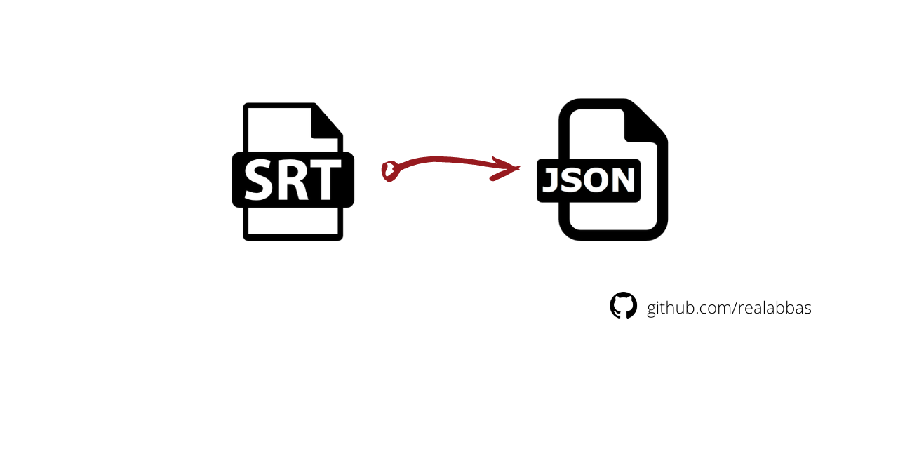

# Convert SRT to JSON Format 

[](https://www.npmjs.com/package/srt-convert-json)
[](https://www.npmjs.com/package/srt-convert-json)



This npm package converts a SRT SubRip File (Subtitle File) into JSON format.

## Package Install Instructions

```
$ npm install srt-convert-json
```

## Usage

```js
const convert = require('srt-convert-json')

convert.process("INPUT_FILE_PATH","OUTPUT_FILE_PATH")
// convert.process("./data.srt","./subtitle.json")
```

For Example, this is an SRT File

```
1
00:02:38,910 --> 00:02:40,161
English! I'm English!

2
00:05:40,049 --> 00:05:41,801
It's grenadiers, mate.
```

After converting, the output will be 

```
[
    {
        "position": 1,
        "start": "00:02:38",
        "timer1": "910",
        "end": "00:02:40",
        "timer2": "161",
        "text": "English! I'm English!"
    },
    {
        "position": 2,
        "start": "00:05:40",
        "timer1": "049",
        "end": "00:05:41",
        "timer2": "801",
        "text": "It's grenadiers, mate."
    },
]
```

